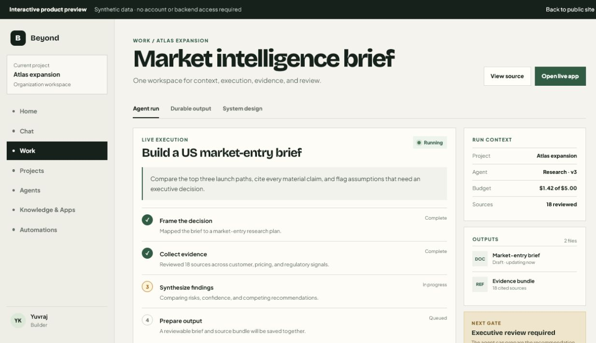
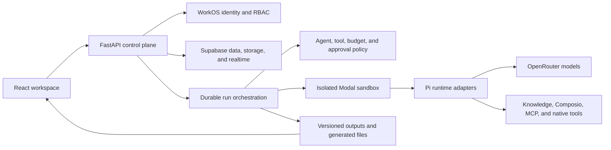

# Beyond Chat

An organization-first agent workspace that keeps project context, execution, evidence, approvals, and durable outputs in one place.

[](https://github.com/YuvrajKashyap/Beyond-Chat/actions/workflows/ci.yml)




[Live team product](https://beyond-chat-production.vercel.app/) · [Detailed case study](docs/portfolio/CASE_STUDY.md) · [Architecture plan](plan.md) · [Product truthfulness](docs/product/public-truthfulness.md)

## Recruiter snapshot

| | |
|---|---|
| Product | Multi-tenant AI work environment for reusable agents and reviewable deliverables |
| My role | Product and frontend engineering contributor on a collaborative team project |
| Core stack | React, TypeScript, FastAPI, Supabase, WorkOS, Modal, Pi, OpenRouter, Vercel |
| Engineering focus | Durable runs, scoped knowledge, agent configuration, output review, RBAC, and operational safety |
| Current state | Working pre-production product with a public deployment and an explicit synthetic recruiter preview |

## The problem

Chat is useful for a single answer, but weak at preserving the full shape of professional work. Context gets separated from execution, sources disappear from final deliverables, and useful results become difficult to review or reuse.

Beyond Chat treats an agent run as a durable project operation. Before execution, the system resolves the organization, project, agent version, allowed tools, knowledge, memory, budget, and approval policy. During execution it records ordered events and generated files. After execution it promotes useful work into versioned outputs that can be reviewed, approved, and reused.

## Product flow

```text
choose an organization and project
                 ↓
invoke a versioned agent with scoped context
                 ↓
execute in an isolated sandbox and stream events
                 ↓
save cited files and a durable output
                 ↓
review, approve, reuse, or automate the workflow
```

The product surface includes Home, Chat, Work, Projects, Agents, Knowledge & Apps, Automations, Memory, Outputs, Settings, and organization administration.

## What makes it technically interesting

- **Durable execution:** a run exists before work starts and supports events, leases, checkpoints, cancellation, suspension, recovery, budgets, and replay.
- **Explicit capability resolution:** agent versions, skills, tools, apps, knowledge, memory, and policy are resolved into a reproducible execution contract.
- **Tenant-aware security:** WorkOS organizations and server-enforced roles combine with organization-scoped data access and row-level security.
- **Isolated tool use:** production work is designed to execute in Modal sandboxes instead of sharing a mutable application host.
- **Reviewable outputs:** generated work keeps source-run provenance, files, version history, collaboration, and approval state.
- **Truthful failure states:** unavailable providers, disconnected apps, missing permissions, and empty data are shown explicitly instead of being replaced with fake success.

## My contribution

This is a collaborative project, not a solo build. The upstream Git history verifies my work across:

- Dashboard, navigation, landing, login, settings, and interaction polish.
- Reminder workflows and their dashboard experience.
- Artifact and conversation actions across frontend API hooks and backend endpoints.
- Writing reliability and performance, including duplicate-save and load-flow fixes.
- Supabase-backed authentication and persisted product-data work during earlier product phases.
- Frontend responsiveness, cursor performance, and deployment/startup hardening.

For this recruiter-ready mirror, I also added the no-login `/showcase` walkthrough, current product imagery, documentation hierarchy, and CI cleanup without weakening the authenticated application path.

The team-owned source of truth is [KushagraBharti/Beyond-Chat](https://github.com/KushagraBharti/Beyond-Chat). This repository is Yuvraj's portfolio mirror of the latest team product plus the clearly separated recruiter showcase layer.

## Recruiter preview

`/showcase` is a read-only, interactive walkthrough built from synthetic data. It demonstrates the product model without exposing customer, account, or provider data and without pretending to be a live backend session.

```powershell
cd frontend
npm ci
npm run dev -- --host 127.0.0.1 --port 5173
```

Open `http://127.0.0.1:5173/showcase`.

The public deployment remains the real product surface. Authenticated functionality depends on correctly configured WorkOS, Supabase, Modal, and model/provider services.

## Architecture



See [plan.md](plan.md) for the current architecture contract and [the case study](docs/portfolio/CASE_STUDY.md) for the product decisions behind it.

## Local development

Prerequisites: Node.js 24+, Python 3.11+, `npm`, and `uv`.

```powershell
# backend
cd backend
Copy-Item .env.example .env
uv sync --locked --dev
uv run uvicorn src.main:app --reload --host 127.0.0.1 --port 8000

# frontend, in a second terminal
cd frontend
Copy-Item .env.example .env.local
npm ci
npm run dev -- --host 127.0.0.1 --port 5173
```

The frontend proxies `/api/*` to `127.0.0.1:8000` in local development. Provider-backed flows require valid local configuration; the recruiter preview does not.

## Verification

The repository CI checks tracked secrets, frontend lint/tests/build, backend tests, Dexter type safety/tests, sandbox-runner types, vendored Pi provenance and boundaries, shared runtime packages, and frozen product-journey evaluations.

```powershell
cd frontend
npm run lint
npm test
npm run build

cd ../backend
uv run --locked pytest
```

## Repository map

```text
frontend/                     React/Vite product and public showcase
backend/                      FastAPI API, persistence, providers, migrations
agents/                       Built-in agent definitions
packages/                     Contracts, registries, policy, memory, outputs
services/                     Runtime and Modal control-plane services
supabase/migrations/          Canonical database migrations
docs/                         Architecture, operations, product, and case study
vendor/pi/                    Pinned upstream Pi source and provenance metadata
```

## Status, source, and licensing

Beyond Chat is a working pre-production team project. The public landing page is live; provider-backed production readiness still depends on external configuration and verification recorded in [the production-readiness audit](docs/operations/configuration/production-readiness.md). Draft Terms and Privacy pages are not effective legal documents.

This repository includes vendored and adapted upstream software with its own notices, including Pi. See [the Pi third-party notices](vendor/pi/THIRD_PARTY_NOTICES.md) and the files under `vendor/pi/`. No project-wide open-source license has been declared; public source visibility does not grant reuse rights.
