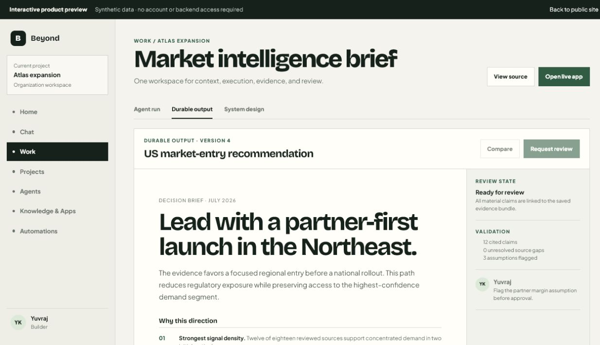
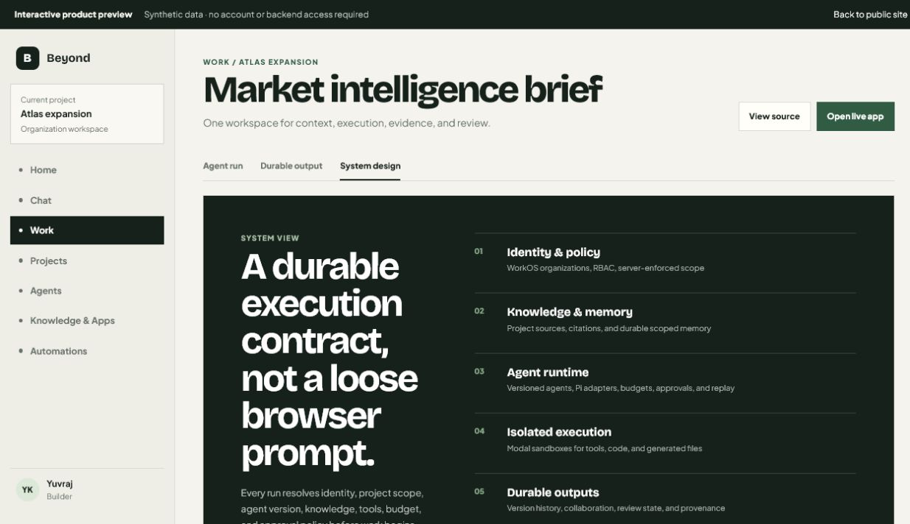

# Beyond Chat: from disposable chats to durable work

## Summary

Beyond Chat is a collaborative, organization-first agent workspace. Its core premise is that professional AI work should not end as a transient message. The system keeps the task, scoped context, execution history, evidence, generated files, and review state together so a team can inspect and reuse the result.

**My role:** product and frontend engineering contributor. My verified Git history covers dashboard and navigation systems, reminder workflows, artifact and conversation actions, writing reliability and performance, authentication and persisted-data work in earlier phases, interaction polish, and deployment fixes.

**Team ownership:** the project is jointly built. [KushagraBharti/Beyond-Chat](https://github.com/KushagraBharti/Beyond-Chat) is the team-owned upstream; [YuvrajKashyap/Beyond-Chat](https://github.com/YuvrajKashyap/Beyond-Chat) is the portfolio mirror.

## Product challenge

Most AI interfaces optimize for the next message. A real work product has a longer lifecycle:

1. A person frames a decision inside an organization and project.
2. An agent receives approved context, tools, and constraints.
3. Work runs long enough to require progress, recovery, and cost controls.
4. Sources and generated files need to remain connected to the result.
5. People review, revise, approve, and reuse the output.

Treating these steps as one chat transcript creates weak provenance, poor governance, and throwaway results. Beyond Chat instead models projects, agent versions, durable runs, ordered events, outputs, versions, reviews, memory, and automations as first-class product objects.

## Product walkthrough

The recruiter preview is intentionally synthetic and read-only. It shows the product model without requiring an account or touching backend data.

### 1. Run context and execution

The workspace keeps the active project, immutable agent version, budget, evidence count, output files, and next human gate visible beside the execution trace. Unavailable capabilities are surfaced as unavailable; the application does not fall through to simulated success.

### 2. Durable output

A useful run becomes an output rather than a final message. Outputs can preserve generated files, citations, version history, validation, comments, review requests, and approval decisions.

### 3. System contract

Every run resolves a contract before execution: identity and role, organization and project, agent version, knowledge and memory, allowed apps and tools, budget, provider readiness, and approval policy.

## Engineering decisions

### Create the run before doing the work

FastAPI creates the durable run record first. Ordered events, leases, checkpoints, suspension, cancellation, reconciliation, generated files, and replay are part of the lifecycle rather than UI-only state. This makes recovery and auditability possible when execution crosses request boundaries.

### Separate the control plane from isolated execution

The application API owns identity, authorization, persistence, and run orchestration. Tool use and code execution belong in isolated Modal sandboxes. The Pi runtime is wrapped behind Beyond Chat contracts so the product is not coupled directly to a browser prompt or one model-provider SDK.

### Resolve capabilities instead of exposing everything

Agent definitions are versioned. Skills, tools, applications, MCP servers, knowledge, memory, model access, budgets, and approvals are resolved according to organization and project policy. A disconnected provider stays disconnected in the UI.

### Promote results into collaborative objects

Outputs retain their source-run provenance. Version history, comments, review state, collaborators, validation, and generated files are modeled around the output so the useful artifact survives the conversation that created it.

### Keep the recruiter path separate from production data

The public `/showcase` route uses clearly labeled synthetic content and no authenticated APIs. It does not add fixture fallback to the real workspace, bypass `ProtectedRoute`, or imply that an external provider is configured. This makes the project reviewable without weakening the application.

## My contribution in context

The repository history verifies contributions across four recurring themes:

- **Product surfaces:** dashboard explorations, navigation, landing, login, settings, reminders, and UI cleanup.
- **Workflow reliability:** writing load performance, duplicate-save prevention, document and conversation actions, and rich interaction behavior.
- **Full-stack integration:** frontend API hooks paired with backend artifact and thread endpoints, authentication, and persisted product-data work.
- **Release quality:** frontend performance fixes, Vercel/startup hardening, documentation cleanup, and the recruiter showcase/CI repair in this mirror.

I am deliberately not presenting the entire architecture or product as solo work. The value of this project is also the collaboration: multiple contributors evolved the system from a studio-style prototype into an organization-centered agent platform.

## Verification and quality boundaries

The CI pipeline covers:

- Tracked credential and common live-secret signatures.
- Frontend lint, component tests, and production build.
- FastAPI backend tests.
- Dexter type checking and tests.
- Sandbox-runner and product-catalog type safety.
- Vendored Pi provenance, reproducible selected-package builds, and import boundaries.
- Shared contracts/runtime packages and frozen product-journey evaluations.

The repository is not presented as fully launched SaaS. WorkOS, Supabase, Modal, model providers, connectors, billing, DNS, and production operations still require environment-specific verification. Those boundaries are recorded in the operations docs rather than hidden from a reviewer.

## What I would measure next

- Time from project selection to first useful output.
- Percentage of material output claims with reviewable citations.
- Run recovery rate after worker or provider interruption.
- Human approval latency and changes-requested rate.
- Reuse rate for saved outputs, agent versions, and automations.
- Cost per approved output instead of cost per chat message.

These metrics would test the actual product thesis: whether durable, governed agent work is more useful to a team than another isolated chat surface.
